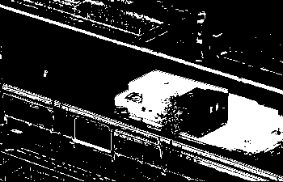

# background-subtraction

Implementation of a correntropy-based adaptive filter used as a background
subtractor.

## Compile & run

```
make
./main.out
```

## Examples

#### Highway

Input image (original):


Least Mean Squares filter:


Correntropy-based filter:


#### Videos with heavy camera jitter

Input image (original):


Least Mean Squares filter:



Correntropy-based filter:


## Datasets

The datasets can be downloaded from http://www.changedetection.net/

## Reference

This work is mainly based on the secction 2 of "Background modeling using
Object-based Selective Updating and Correntropy adaptation"

----

[Manuel Pineda](https://github.com/pin3da) - [Carlos Gonzalez](https://github.com/caal-15)
